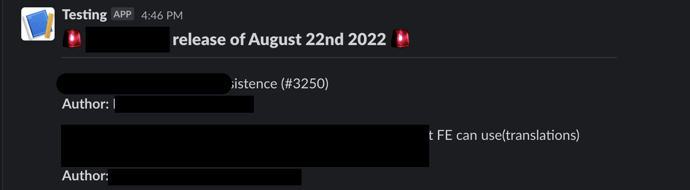
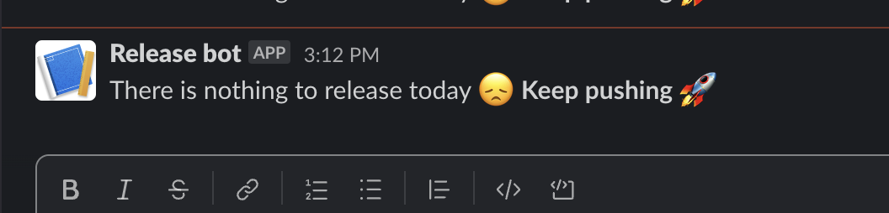

# GitHub Action for notify GIT DIFF with connecting JIRA tickets to slack channel

## Feature

This custom action can sent a GIT DIFF with connecting JIRA tickets to a release slack channel.

## Usage

```yaml
- name: Git diff notification messages on Slack linked to JIRA tickets
  uses: Dutchie1990/GitDiffNotifierInSlack@v2
  with:
    compareURL: ${{ secrets.COMPARE_URL }}
    projectNames: ${{ secrets.PROJECT_NAMES }}
    slackWebhook: ${{ secrets.INCOMING_WEBHOOK_URL }}
    repository: ${{ secrets.REPOSITORY }}
    authToken: ${{ secrets.AUTH_TOKEN }}
    jiraURL: ${{ secrets.JIRA_URL }}
    repositoryKind: 'private'
    access_token: ${{ github.token }}
    run_ID: ${{ github.run_id }}
    organizationName: ${{ secrets.ORGANIZATION }}
```

## Params

- compareURL:
  Please define the git diff URL of your repository,
  { required: true }
- projectNames:
  Please define your JIRA project names,
  { required: true }
- slackWebhook:
  Please define your slack webhook,
  { required: true }
- repository:
  Please define your repository name,
  { required: true }
- authToken:
  Please define your github auth token,
  { required: false }
- jiraURL:
  Please provide the jira project names,
  { required: true }
- repositoryKind:
  Please state if the repository is public or private,
  { required: true }
- access_token:
  Access token to cancel the github action, normally ${{ github.token }}
  { required: true }
- run_ID:
  Run ID for cancellation, normally ${{ github.run_id }}
  { required: true }
- organizationName:
  Please define your organization's name
  { required: true }

Here's what the Slack message would look like:

In case something is pending for the release



In case nothing is pending for the release



## Change the icon

You can change the icon for a Slack message in the Slack App settings.

Slack's new Incoming Webhooks do not allow API payloads to override the icon.

- Open [Your Apps](https://api.slack.com/apps) page
- Select your app for Incoming Webhooks
- Select `Basic Information` > `Display Information`
- Set any icon you like!
